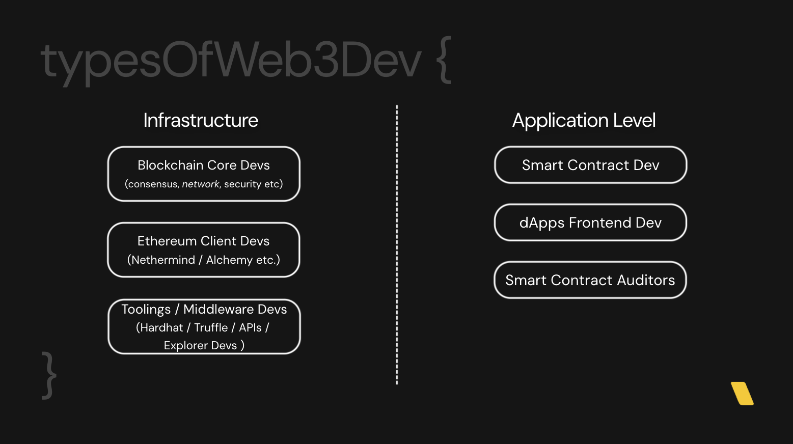

# workshop-solidity-for-apubcc-2024

This is the repo of the documentations and codebase for my solidity workshop for APU Blockchain Club dated 30th of March, 2024.


## Author

Alvin Yap@[Linktree](https://linktr.ee/alvinyap)

## Link to Slides

[Link to Pitch.com Slides](https://pitch.com/v/solidity-workshop-apubcc-2024-mykvxz)

## A. Pre-Requisite

Before the workshop, ensure you have:

1. Node.js and npm installed. [Link](https://nodejs.org/en)

2. Personal preference as alternative of npm - yarn

```shell
npm install -g yarn
```

3. Ganache for a local blockchain simulation. [Link](https://trufflesuite.com/ganache/)

4. Basic knowledge of JavaScript.

5. Some Sepolia Testnet ETH for testing purposes. [Link](https://faucetlink.to/sepolia)

## B. Types of Web3 Devs



Web3 development is broadly categorized into infrastructure and application-level work:

### Infrastructure Devs

- <b>Blockchain Core Developers</b>: Involved in the design and implementations of blockchain protocols, focuses on areas such as consensus algorithms, network architecture, security measures etc

- <b>Client Developers</b>: Develop and mantaining Ethereum clent software such as Nethermind / Alchemy, crucial for interacting with the Ethereum / other EVM blockchains

- <b>Tooling/Middleware Developers</b>: Create development tools and middleware (e.g., Hardhat, Truffle).

### Application Level Devs

- <b>Smart Contract Developers</b>: Write code(smart contracts) that runs on the Ethereum Virtual Machine(EVM), creating dApps through smart contracts

- <b>dApps Frontend Developers</b>: Build user interface and experience for dApps, connecting smart contracts to user-friendly web interface

- <b>Smart Contract Auditors</b>: Plays a critical role in the Web3 space by thoroughly examining smart contract code to ensure its security and efficiency, preventing potential vulnarabilities and exploits

## C. Understanding the diffierences between Web2 and Web3 Applications

### Web2 Architecture


### Web3 Architecture


### Explaination

Web2 and Web3 exhibit fundamental differences in terms of application architecture design, yet there are equivalencies between them.

Understanding these differences is crucial for a Web2 full-stack developer transitioning into a Web3 developer.

### Equivalences

- <b>Smart Contracts</b>: In Web3, smart contracts are analogous to the business logic layer of Web2 applications. They autonomously execute the rules of interaction, much like a backend in a traditional web app.

- <b>Blockchain State/Smart Contract State</b>: The state of a blockchain or a smart contract is akin to a Web2 database. It holds the persistent, decentralized ledger of all transactions and data, replacing the centralized databases used in Web2.

### Differences In Terms of Authentication

- <b>Web2 Authentication</b>: Traditional web applications require a username and password, which are verified against stored credentials in a database, often with additional layers like OAuth for enhanced security.

- <b>Web3 Authentication</b>: There's no need for traditional authentication methods in Web3. Instead, users prove ownership of their accounts by signing transactions with their private key, which is mathematically linked to their public address. The ability to sign a transaction is proof of ownership, as only the holder of the private key can correctly sign messages for their public address, which is easily verifiable by anyone

## D. Tasks

For task 1 and task 2, we will use Ethereum's Sepolia Testnet for deployment and tryout Etherscan's contract verification feature.

The experience of deploying contract on another EVM Chain and verifying it will be mostly identical.

Make sure you have sufficient Sepolia Testnet ETH for deployment purpose.

### Task 1: Deploy an ERC-20 Token with remix

[Task 1 Link](./code/task-1-deploy-erc20-with-remix/README.md/)

### Task 2: Code a voting contract and deploy it with Hardhat

[Task 2 Link](./code/task-2-deploy-voting-contract-with-hardhat/README.md)

### Task 3: Deploy your own UniswapV2 Fork

[Task 3 Link](./code/task-3-deploy-backend-of-uniswap-v2-fork/README.md)
