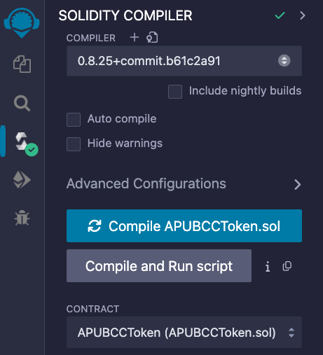
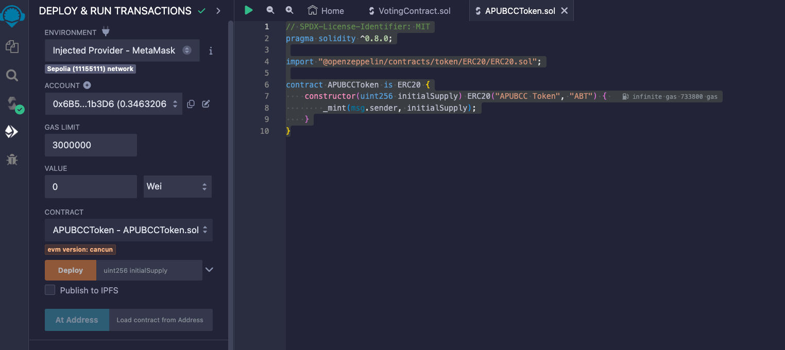
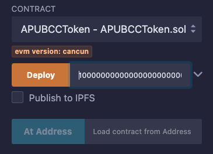
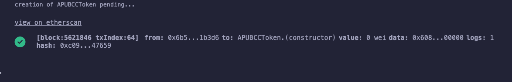
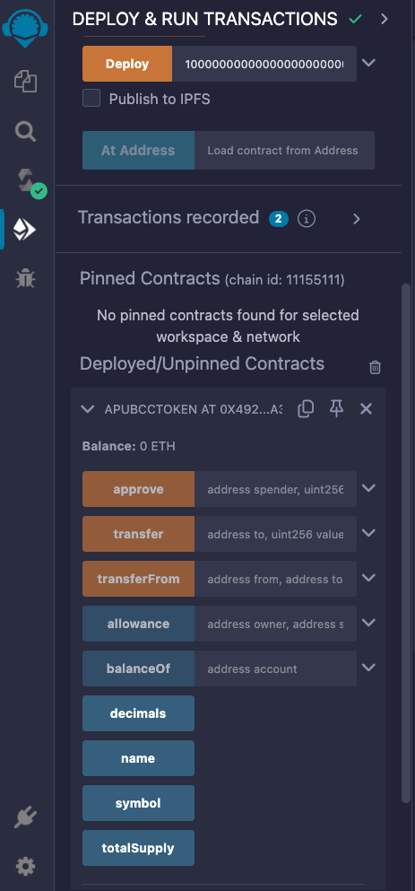
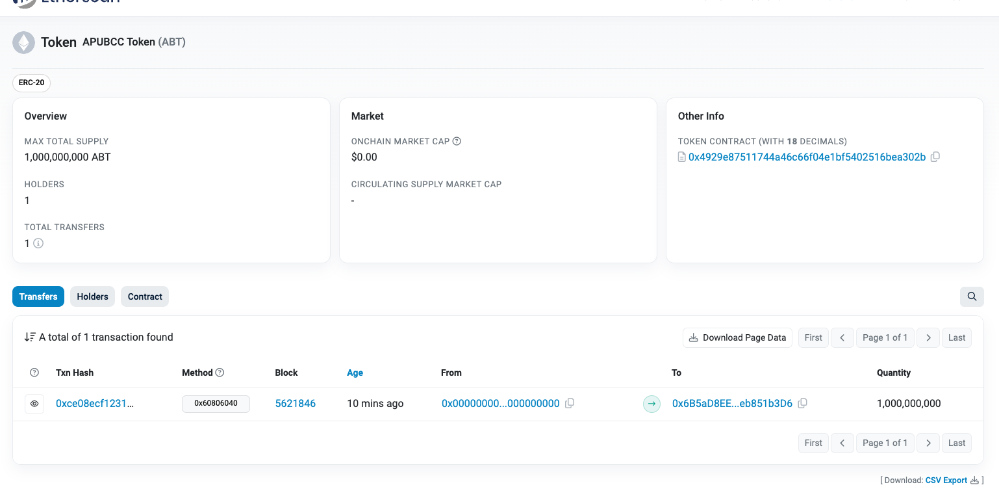
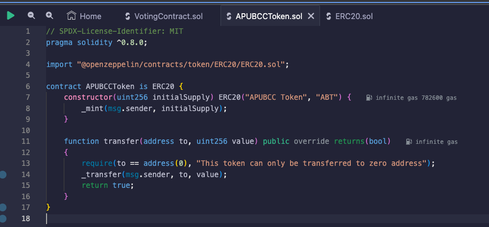

# task-1-deploy-erc20-with-remix

Tools: [Remix IDE](https://remix.ethereum.org/)

Library: [OpenZeppelin's ERC20 Contract](https://docs.openzeppelin.com/contracts/4.x/erc20)

## Step 1: Code

- Open up Remix IDE, create a conrtract of your preffered name with suffix ".sol"
- Copy paste the below OpenZeppelin's code base onto the IDE, and change the contract name, token name, and token symbol to your preferences

```solidity
// SPDX-License-Identifier: MIT
pragma solidity ^0.8.0;

import "@openzeppelin/contracts/token/ERC20/ERC20.sol";

contract APUBCCToken is ERC20 {
    constructor(uint256 initialSupply) ERC20("APUBCC Token", "ABT") {
        _mint(msg.sender, initialSupply);
    }
}
```

## Step 2: Compile

- On the side bar, navigate to Solidity Compiler and select the latest compiler version
- Click compile, and if code doesn't shows any error, there will be a green tick appear beside the icon
- 

## Step 3: Network Environment

- Navigate to "Deploy & Run Transactions", and you can select your deployment environment
- For this exercise purpose we will use Metamask the sign the deployment transaction, thus we select Injected Provider - Metamask at the Environment Bar
- Make sure you have already swtiched your Metamask's network to Sepolia Testnet or your preferred network beforehand
  

## Step 4: Constructor Argument & Deploy

- Let's key in the constructor argument, as the contract's constructor is expecting 1 parameter `uint256 initialSupply`
- Note that by default ERC20 comes with 18 decimals, thus if you want to create a token with 1 billion initial supply, you should key in `1000000000000000000000000000`
- 
- Click deploy and approve the deployment message with your metamask wallet

## Step 5: Deployed Contract

- Remix will provide you with an Etherscan link to the contract that you have just deployed
- 
- Alternatively, you can also get your deployed contract via the "Deployed/Unpinned Contracts" section on the sidebar, and interact with it
- 

## Step 6: Token Contract



- Etherscan will correctly identify the contract as a token contract, and display its token tracking info

- Essentially, Ethereum standards like ERC-20 and ERC-721 outline specific functions a contract should have to ensure compatibility with other apps and services. For ERC-20, these include:

  - totalSupply(): Total tokens available.
  - balanceOf(address): Tokens owned by an address.
  - transfer(address, amount): Move tokens to an address.
  - transferFrom(from, to, amount): Transfer on someone's behalf.
  - approve(spender, amount): Allow a third party to spend tokens.
  - allowance(owner, spender): Check the approved amount.

- One can acutally override the implementation of the said functions, example:
  
- On this example, the underlying transfer function has been overriden, with the logic only allow transfer to the zero address. This is still a legit ERC-20 token as it still has the same interface as one, however the implementation of it is customized
